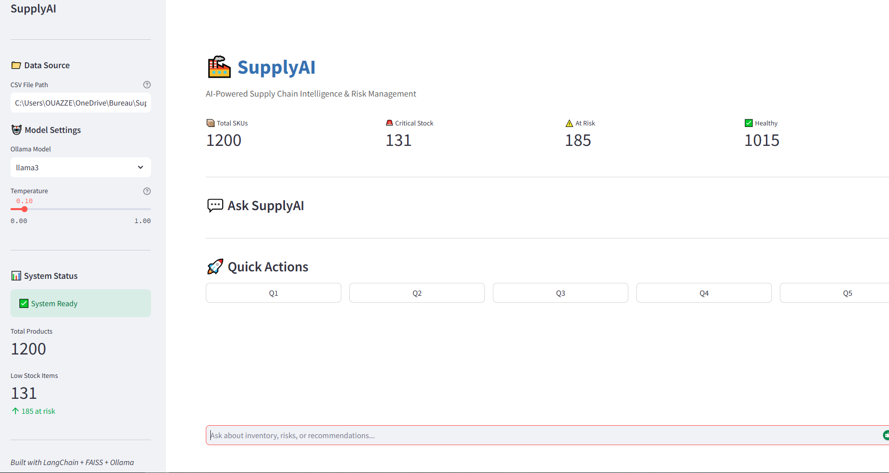

# 🏭 SupplyAI — Assistant IA pour la Chaîne d'Approvisionnement

<p align="center">
  
  <br>
  <i>Interface principale de SupplyAI — Tableau de bord, métriques d'inventaire et chat interactif</i>
</p>

---


------------------------------------------------------------------------

## 📋 Table des matières

1.  Vue d'ensemble
2.  Fonctionnalités
3.  Architecture
4.  Structure du projet
5.  Prérequis
6.  Installation
7.  Format CSV
8.  Configuration
9.  Utilisation
10. Modules
11. Détection des risques
12. Download
13. Dépannage
14. Feuille de route
15. Licence

------------------------------------------------------------------------

## 🎯 Vue d'ensemble

SupplyAI est un assistant intelligent pour la supply chain utilisant
FAISS + Llama3 (Ollama) en local.

------------------------------------------------------------------------

## ✨ Fonctionnalités

-   Recherche sémantique
-   LLM local
-   Pipeline RAG
-   Détection des risques
-   Interface Streamlit

------------------------------------------------------------------------

## 🏗️ Architecture

CSV → Loader → Documents → Embeddings → FAISS → RAG → LLM → UI

------------------------------------------------------------------------

## 📁 Structure du projet

SupplyAI/ ├── app/ ├── chains/ ├── data_loader/ ├── embeddings/ ├── llm/
├── prompts/ ├── vectorstore/ ├── main.py ├── requirements.txt └──
README.md

------------------------------------------------------------------------

## 🛠️ Prérequis

-   Python 3.11
-   Ollama

``` bash
ollama pull llama3
```

------------------------------------------------------------------------

## 📦 Installation

``` bash
git clone https://github.com/ton-username/SupplyAI.git
cd SupplyAI
python -m venv venv
source venv/bin/activate
pip install -r requirements.txt
```

------------------------------------------------------------------------

## 📊 Format CSV

product_id,product_name,current_stock,reorder_level,supplier,lead_time_days,demand_forecast

------------------------------------------------------------------------

## ⚙️ Configuration

LLM: model_name = "llama3"

Embeddings: all-MiniLM-L6-v2

FAISS: k=5

------------------------------------------------------------------------

## 🚀 Utilisation

``` bash
python main.py
streamlit run app/streamlit_app.py
```

------------------------------------------------------------------------

## 🚨 Détection des risques

-   Stock critique
-   Rupture
-   Délais fournisseurs
